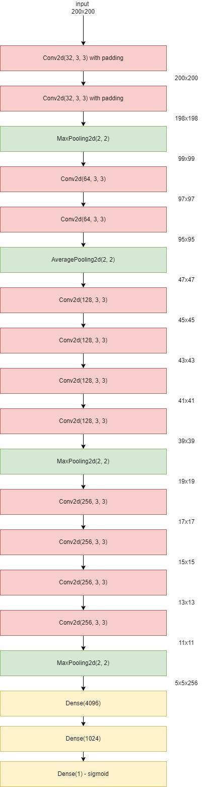
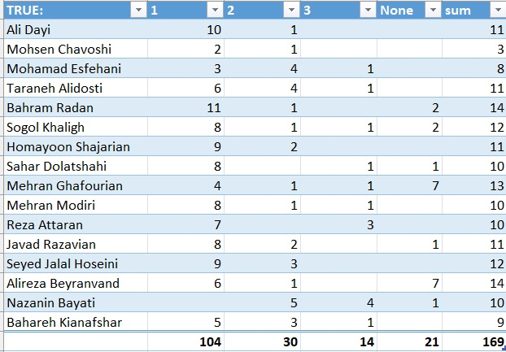
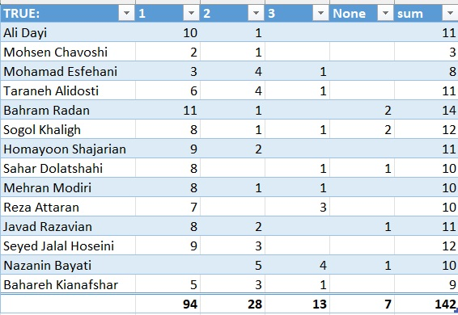
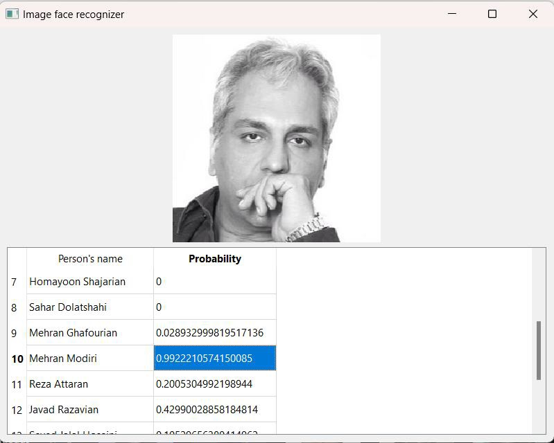

# Face Recognition Project Readme

Author: Amir Arsalan Sanati

## Introduction
This project implements a face recognition system using tensorflow and keras. The system utilizes preprocessing techniques, data augmentation, and neural networks to create a 16-class face recognition model with high accuracy. The model is designed to distinguish faces of 16 different known Persian celebrities:

- **Ali Dayi**
- **Mohsen Chavoshi**
- **Mohamad Esfehani**
- **Taraneh Alidosti**
- **Bahram Radan**
- **Sogol Khaligh**
- **Homayoon Shajarian**
- **Sahar Dolatshahi**
- **Mehran Ghafourian**
- **Mehran Modiri**
- **Reza Attaran**
- **Javad Razavian**
- **Seyed Jalal Hoseini**
- **Alireza Beyranvand**
- **Nazanin Bayati**
- **Bahareh Kianafshar**

NOTE: This readme provides an overview of the face recognition project, its structure, and key findings. For detailed implementation and code explanations, refer to the [report file](docs/report_english.pdf).

## Project Structure
The project consists of three main files:

1. **Preprocessing.py**: This file contains functions for data augmentation and preprocessing. It generates `train.csv` and `test.csv` files from raw input photos, performs resizing, and handles color augmentation.

2. **Main.py**: Here, the neural network architecture is implemented, trained, and evaluated using the data prepared in the preprocessing step.

3. **Prediction.py**: This file contains the frontend of the project, which is a desktop application. It loads the trained models and predicts the class of a given input photo.

## Preprocessing
The preprocessing involves several steps:

- **Hand-cropping Images**: Each image in the raw input dataset is cropped to contain only the face of the target person.
- **Data Augmentation**: Various augmentation techniques are applied to increase the diversity of the dataset.
- **CSV File Generation**: Functions are implemented to create CSV files containing flattened images along with their corresponding labels.

## Main.py
This file focuses on implementing, training, and evaluating the neural network architecture. The architecture of the network evolves to handle the complexities of facial recognition. The final architecture achieves significantly improved accuracy compared to earlier iterations.

### About the architecture
In brief, I didn't use pre-trained models and transfared learning and this was the architecture I came up with to have the best result and performance. The architecture could not be so complicated because of the memory limitations in my graphic card (for mor information see the report).

## Prediction.py
This section implements the frontend of the project, allowing users to predict the identity of faces in images. A trust coefficient is introduced to improve the predictions of less reliable models.

## Evaluation
After extensive training and testing, the model achieves an average accuracy of 85% across all classes (some classes even achived 95% accuracy). Further evaluation using a new dataset of 170 images demonstrates the model's effectiveness, with approximately 90% of test images being correctly identified.

Approximately 90% (87%) of the test images were guessed correctly (the image's class was among the top three choices of the model). Among the correct guesses, 70% of them were rank 1, 20% of them were at rank 2, and the rest were at rank 3.
Also if we remove the two worst individual models (Mehran Ghafourian and Alireza Beyranvand) the percentage of correct guesses will reach to 95% of the hole test images (that means, we don’t want to predict their images, and they will be removed from the list of celebrities which we intend to predict their faces).

## How to Use
1. **Preprocessing**: 
    - Run `Preprocessing.py` to preprocess the raw input photos and generate `train.csv` and `test.csv`.
2. **Training**:
    - Execute `Main.py` to implement, train, and evaluate the neural network architecture.
3. **Prediction**:
    - Run `Prediction.py` to utilize the frontend of the project. Drag and drop your desired photo onto the application window to predict the class of the face.
    - Put the address of your models inside the parameter of (load_model) method (in the `Prediction.py` file) and simply run the `Prediction.py` (you can also use the [uploaded models](docs/models)).
    - NOTE that the images you give to the application should contain only and only a single object (face of the person) here is and example:

      

   for more examples, please check the report file.

## Conclusion
The project demonstrates the effectiveness of using preprocessing techniques and neural networks for face recognition tasks. While improvements can be made through additional data gathering and model tuning, the current system offers a solid foundation for further exploration.

For more advanced applications, techniques such as transfer learning or utilizing pre-trained models like ResNet can be explored to enhance performance further.

---

